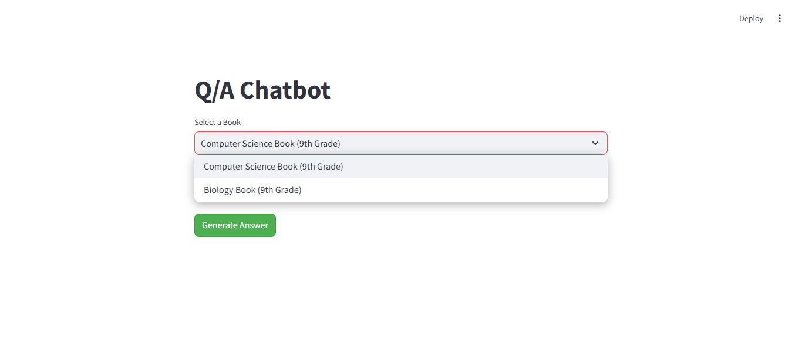
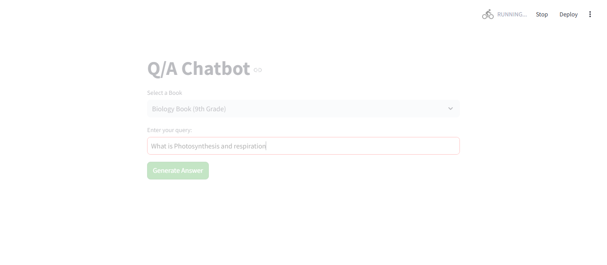
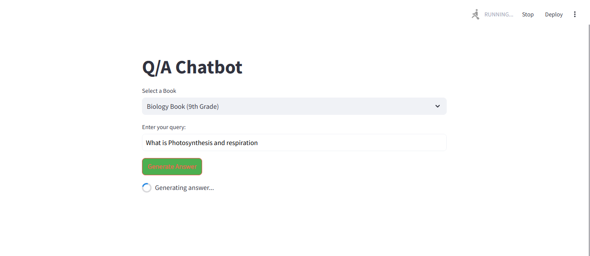
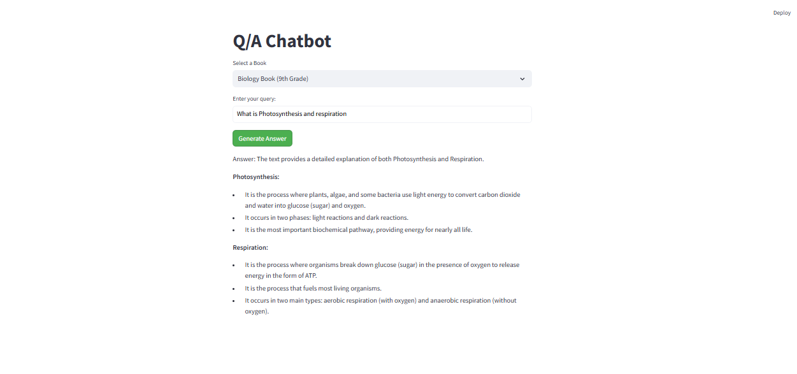

# 📘 EduQ: Intelligent Q/A System for Students 📘

**EduQ** — a personalized, AI-driven Q/A Retrieval-Augmented Generation (RAG) system crafted specifically for students across different classes and subjects. This system enables seamless access to embedded knowledge, allowing students to query specific textbooks stored as embeddings within **Pinecone**. With **Gemini’s flash model** for rapid, accurate predictions and **Streamlit** as the user interface, EduQ offers a responsive and engaging experience for educational inquiries.

---

## 🚀 Features & Capabilities

- **📚 Subject-Specific Retrieval**: Pinecone vector database enables retrieval of relevant content from multiple textbooks embedded by subject and class.
- **💡 Contextual Answer Generation**: Gemini flash model generates precise answers tailored to the student's selected book and query.
- **🎨 Interactive User Interface**: Built on Streamlit, providing an intuitive and clean interface for an optimal Q/A experience.

---

## 🎬 Demo

Here’s a look at **EduQ** in action! See how students can select a book, enter a query, and receive instant, relevant answers.

### 1. Selecting a Subject and Book


Students select the book they want to query from within the Streamlit UI.

### 2. Querying the Textbook


Type a question, and the system initiates the intelligent retrieval process.

### 3. Retrieval with Pinecone


Using Pinecone's vector database, EduQ locates the most contextually relevant information stored within the selected book.

### 4. Final Answer Display


The generated answer appears instantly on the Streamlit interface, giving the student direct feedback to their question.

---

## 🎉 What Makes EduQ Unique?

- **Class-Specific & Subject-Focused**: Students choose specific books, enhancing the relevance and accuracy of responses.
- **Scalable Q/A System**: Optimized for multiple subjects and high query volumes.
- **Flexible and Future-Proof**: Easily extendable to add more books, classes, or models.

---

## 🛠️ Quickstart Guide

### Step 1: Requirements
- Python 3.x
- Pinecone API Key
- Gemini API Key

### Step 2: Installation

1. Clone the repository:
   ```bash
   git clone https://github.com/YourUsername/eduq-ai.git
   cd eduq-ai


2. **Install dependencies:**
   ```bash
   pip install -r requirements.txt

3. **Setup API keys:**
Set your Pinecone and Gemini API keys in the environment variables or within the configuration file as needed.

4. **Run the App:**  
Launch the Streamlit app:
   ```bash
   streamlit run app.py

## 🔍 How It Works

1. **Book Selection**: The student selects a subject-specific book from the UI.
2. **Input Query**: The student enters a question related to the selected book.
3. **Similarity Search**: Pinecone performs a similarity search on embeddings for the chosen book, finding the most relevant content.
4. **AI-Driven Answer Generation**: The Gemini flash model uses retrieved embeddings to generate a contextual answer.
5. **Instant Display**: The system instantly shows the answer on the Streamlit interface.

---

## 🤝 Contributing

Feel free to open issues or submit pull requests! Join us in advancing educational Q/A through the power of AI.


